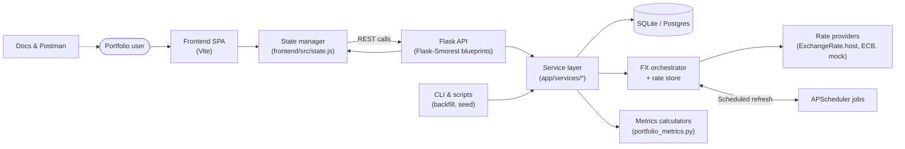

# FX Risk Calculator


Lightweight Flask service scaffold for monitoring FX risk. The project uses an
application factory pattern with environment-driven configuration and modular
blueprints.

## Quick Start
1. Create and activate a virtual environment:
   ```bash
   python -m venv .venv
   .\.venv\Scripts\activate    # On Windows
   # source .venv/bin/activate # On macOS/Linux
   ```
2. Install dependencies:
   ```bash
   pip install -r requirements.txt
   ```
3. Copy the sample environment file and adjust values as needed:
   ```bash
   copy .env.example .env
   ```
4. (Optional) Install frontend tooling for lint/format:
   ```bash
   cd frontend
   npm install
   cd ..
   ```
   This enables `npm run lint` / `npm run format` for the SPA source.
5. Install git hooks for local linting:
   ```bash
   pre-commit install
   ```
6. Run the development server:
   ```bash
   python run.py
   ```
   The API will listen on `http://127.0.0.1:5000` by default.

## Architecture Overview


## Local Data & Seeding
- Run database migrations before first use: `alembic upgrade head`. The initial
  revision seeds the currency registry so validation works out of the box.
- Populate historical FX rates when you need meaningful metrics:
  ```bash
  flask --app app.cli.backfill backfill-rates --days 30 --base USD
  ```
- Seed the demo portfolio on first run to populate dashboards:
  ```bash
  flask --app app.cli.seed_demo seed-demo
  ```
  This command is idempotent and will recreate the "Global Book (USD)" sample positions when needed.
- Generate a sample portfolio (~2k positions) and verify latency budgets with:
  ```bash
  python scripts/perf_sanity_check.py --reset
  ```
  See `docs/performance.md` for the expected output and query plans.

## Configuration
- `APP_ENV` selects the config class (`development` or `production`).
- `DATABASE_URL`, `SECRET_KEY`, `SCHEDULER_TIMEZONE`, and other variables are
  documented in `.env.example`.
- Optional dependency `python-dotenv` auto-loads `.env` when present.
- Database migrations are managed with Alembic. Ensure Alembic is installed and
  run `alembic upgrade head` to apply the latest schema.
- `FX_RATE_PROVIDER` switches between data sources (`mock`, `exchangerate_host`, or `ecb`).
  ExchangeRate.host is keyless; the ECB fallback uses Frankfurter (`FRANKFURTER_API_BASE_URL`).
- `FX_FALLBACK_PROVIDER` optionally selects a secondary provider when the primary fails.
- `REQUEST_TIMEOUT_SECONDS`, `RATES_API_*`, and `FRANKFURTER_API_*` share the unified HTTP client
  (retries with exponential backoff plus jitter).
- `FX_CANONICAL_BASE` defines the stored canonical base (default `USD`); other view bases are computed on demand via rebasing helpers.

- `SCHEDULER_ENABLED` toggles APScheduler integration. `RATES_REFRESH_CRON` sets the cron expression.
- `REFRESH_THROTTLE_SECONDS` controls how frequently `POST /rates/refresh` may succeed (default 60 seconds). Set to `0` to disable throttling.
- CORS is opt-in: configure `CORS_ALLOWED_ORIGINS`, `CORS_ALLOWED_HEADERS`, `CORS_ALLOWED_METHODS`, and `CORS_MAX_AGE` (comma-separated values) to permit browser clients like Vite or CRA.
- CLI backfill: `flask --app app.cli.backfill backfill-rates --days 30 --base USD`

## Scheduler & Refresh Workflow
- The orchestrator keeps the most recent successful FX snapshot in memory. When
  both primary and fallback providers fail, the cached snapshot is returned and
  logged with `event=provider.stale` so downstream systems can spot stale data.
- APScheduler registers a `refresh_rates` job driven by `RATES_REFRESH_CRON`. Set
  `SCHEDULER_ENABLED=false` if you prefer manual refreshes only.
- Manual refreshes hit `POST /rates/refresh` and are guarded by the shared
  throttle window. A 429 response includes `retry_after` so callers can back off.
- Provider fetch timings emit structured logs (`event=provider.fetch`) with the
  request id, provider name, and success/error status.

## Provider Ordering & Data Attribution
- The canonical rates source defaults to `exchangerate_host` (ExchangeRate.host)
  with an optional fallback to the European Central Bank via the Frankfurter API.
- Set `FX_RATE_PROVIDER`/`FX_FALLBACK_PROVIDER` to adjust the order; both rely on
  the same HTTP client settings (`REQUEST_TIMEOUT_SECONDS`, retry policy, etc.).
- Data courtesy of [ExchangeRate.host](https://exchangerate.host) and the
  [European Central Bank](https://www.ecb.europa.eu/) via Frankfurter.

## Endpoints
- `GET /health` returns general service health information.
- `GET /health/rates` reports the FX rates pipeline status (stubbed as
  `uninitialized` while no scheduler jobs run).

## Testing
Run the smoke test suite with:
```bash
pytest
```

Contract tests for the ExchangeRate.host provider rely on mocked HTTP responses:
```bash
pytest tests/test_exchangerate_provider.py
```

To validate migrations locally:
```bash
pytest tests/migrations
```

### Manual Refresh Endpoint
Trigger an on-demand rates refresh:
```bash
curl -X POST http://127.0.0.1:5000/rates/refresh
```
Scheduler uses APScheduler; disable it via `SCHEDULER_ENABLED=false` or adjust cron with `RATES_REFRESH_CRON`.

- Refresh requests are rate-limited per app instance. A 429 response includes `{"retry_after": <seconds>}`. Tune the window via `REFRESH_THROTTLE_SECONDS`.
- When CORS is enabled (see `CORS_ALLOWED_ORIGINS` et al.), preflight (`OPTIONS`) requests are handled automatically for the `/rates/refresh` route.

## API Documentation
- Swagger UI: http://127.0.0.1:5000/docs/
- OpenAPI spec: http://127.0.0.1:5000/docs/openapi.json

### Postman Collection
- Import `postman/fx-risk-calculator.postman_collection.json` for a curated set of health, portfolio, position, rates, and metrics requests.
- Pair it with the environment file `postman/fx-risk-calculator.postman_environment.json` to populate `{{baseUrl}}`, `{{portfolioId}}`, and other reusable variables.
- Run "Create Portfolio" first to set `portfolioId`, then create positions before issuing metrics calls. Use the manual refresh request to pull fresh rates when needed.

## Portfolio API
- `GET /api/v1/portfolios?page=<page>&page_size=<limit>` lists portfolios with pagination metadata.
- `POST /api/v1/portfolios` creates a portfolio. Example:
  ```bash
  curl -X POST http://127.0.0.1:5000/api/v1/portfolios \
    -H "Content-Type: application/json" \
    -d '{"name":"Global Book","base_currency":"USD"}'
  ```
- `GET /api/v1/portfolios/<id>` retrieves a single portfolio.
- `PUT /api/v1/portfolios/<id>` updates the name and/or base currency.
- `DELETE /api/v1/portfolios/<id>` removes a portfolio and cascades to positions.

Validation rules:
- The `base_currency` must be an ISO-4217 code present in the seeded currency registry; otherwise a 422 response is returned.
- Unknown portfolio identifiers result in 404 responses.

## Position API
- `GET /api/v1/portfolios/<portfolio_id>/positions?page=<page>&page_size=<limit>&currency=<CCY>&side=<LONG|SHORT>` lists positions with optional filters.
- `POST /api/v1/portfolios/<portfolio_id>/positions` creates a position. Example:
  ```bash
  curl -X POST http://127.0.0.1:5000/api/v1/portfolios/1/positions \
    -H "Content-Type: application/json" \
    -d '{"currency_code":"EUR","amount":"2500.00","side":"SHORT"}'
  ```
- `side` defaults to `LONG` when omitted; send uppercase values (`LONG`/`SHORT`) to avoid extra normalization.
- Validation errors return **HTTP 422** with field messages under `errors.json.<field>[]`, for example:
  ```json
  {
    "message": "Submitted data is invalid.",
    "errors": {
      "json": {
        "amount": [
          "Amount must be greater than zero."
        ]
      }
    }
  }
  ```
- `GET /api/v1/portfolios/<portfolio_id>/positions/<position_id>` retrieves a position.
- `PUT /api/v1/portfolios/<portfolio_id>/positions/<position_id>` updates currency, amount, and/or side.
- `DELETE /api/v1/portfolios/<portfolio_id>/positions/<position_id>` removes the position.

Validation rules:
- `currency_code` must be a supported ISO code; otherwise a 422 response is returned.
- `amount` must be a positive decimal string; zero/negative values yield a 422 with a helpful message.
- `side` accepts `LONG` or `SHORT` (case-insensitive).

## Metrics API
- `GET /api/v1/metrics/portfolio/<portfolio_id>/value?base=<CCY>` returns the aggregate portfolio value in the requested base (defaults to the portfolio base).
  ```bash
  curl http://127.0.0.1:5000/api/v1/metrics/portfolio/1/value?base=EUR
  ```
  Response example:
  ```json
  {
    "portfolio_id": 1,
    "portfolio_base": "USD",
    "view_base": "EUR",
    "value": "200.00",
    "priced": 3,
    "unpriced": 0,
    "as_of": "2025-10-16T12:00:00+00:00"
  }
  ```
    - `value` excludes unpriced positions; `unpriced` counts positions missing rates, and `priced` gives the number successfully valued.
    - `as_of` reflects the timestamp of the latest canonical FX snapshot used for the calculation.
    - Requests that reference a view base without a corresponding FX rate return **HTTP 422** with `field: "base"`, the requested `view_base`, and the snapshot `as_of` timestamp so clients can surface actionable errors.

- `GET /api/v1/metrics/portfolio/<portfolio_id>/exposure?top_n=<N>&base=<CCY>` groups exposure by currency (tail aggregated into `OTHER` when `top_n` is reached) in the requested base.
  ```bash
  curl "http://127.0.0.1:5000/api/v1/metrics/portfolio/1/exposure?top_n=3&base=EUR"
  ```
  Response example:
  ```json
  {
    "portfolio_id": 1,
    "portfolio_base": "USD",
    "view_base": "EUR",
    "exposures": [
      {"currency_code": "EUR", "net_native": "200", "base_equivalent": "200"},
      {"currency_code": "USD", "net_native": "150", "base_equivalent": "133.333333333333"},
      {"currency_code": "OTHER", "net_native": "960", "base_equivalent": "-33.333333333333"}
    ],
    "priced": 4,
    "unpriced": 0,
    "as_of": "2025-10-17T12:00:00+00:00"
  }
  ```
  - `net_native` preserves the signed native amount (LONG positive, SHORT negative).
  - `base_equivalent` shows the converted amount in the requested view base; currencies without rates are excluded and counted in `unpriced`.
- `GET /api/v1/metrics/portfolio/<portfolio_id>/pnl/daily?base=<CCY>` compares the latest snapshot to the previous available trading day and reports the daily P&L, snapshot timestamps, and whether the position composition changed.
  ```bash
  curl http://127.0.0.1:5000/api/v1/metrics/portfolio/1/pnl/daily?base=EUR
  ```
  Response example:
  ```json
  {
    "portfolio_id": 1,
    "portfolio_base": "USD",
    "view_base": "EUR",
    "pnl": "-8.00",
    "value_current": "240.00",
    "value_previous": "248.00",
    "as_of": "2025-10-20T12:00:00+00:00",
    "prev_date": "2025-10-19T12:00:00+00:00",
    "positions_changed": false,
    "priced_current": 2,
    "unpriced_current": 0,
    "priced_previous": 2,
    "unpriced_previous": 0
  }
  ```
  - `positions_changed` will flip to `true` if the currency composition (counts by currency/side) differs between snapshots.
  - `value_previous` is `null` when no earlier snapshot exists; in this case `pnl` equals the current value.


## Structured Logging
- Set `LOG_JSON_ENABLED=true` to emit JSON-formatted logs. Each request log now carries `event`, `route`, `method`, `status`, `duration_ms`, `request_id`, `source`, and `stale` fields, and responses include an `X-Request-ID` header.
- Provider fetch attempts are logged with per-provider timings (`event=provider.fetch`, `duration_ms`, `provider`, `status`) while stale cache fallbacks emit `event=provider.stale` with `stale=true` so pipelines can track data freshness.


## Development Tooling
- Install git hooks once with `pre-commit install`.
- `make lint` runs Python and frontend linters; `make format` formats code; `make typecheck` runs mypy.
- Inside `frontend/`, you can also run `npm run lint` and `npm run format` directly.
- Update the coverage badge with `coverage run -m pytest && coverage-badge -o coverage.svg`.

### Performance Sanity Check

Use `python scripts/perf_sanity_check.py` to seed a ~2k-position dataset and print latency numbers for the main portfolio metrics endpoints. See `docs/performance.md` for sample output and interpretation guidelines.

### Release Checklist

1. `make release-check` ? runs lint, type checks, test suite, and a quick `/health` smoke test.
2. `flask --app app.cli.seed_demo seed-demo` to pre-load the demo portfolio before recording or demoing.
3. Start the server (`python run.py`) and verify the dashboard at http://127.0.0.1:5000#/dashboard renders charts with the seeded data. Use the **View in** dropdown to switch base currencies; the selection persists between reloads.
4. Optionally export fresh Postman results for the release notes.

## Troubleshooting
- **`sqlite3.OperationalError: no such table`** - run `alembic upgrade head` to
  apply migrations before starting the app or executing CLI commands.
- **Provider timeouts** - double-check internet connectivity and increase
  `REQUEST_TIMEOUT_SECONDS` if your network is slow. Enable a fallback provider
  to improve resilience when the primary is down.
- **Repeated 429 on `/rates/refresh`** - the throttle is still active. Either wait
  for the window to elapse or lower `REFRESH_THROTTLE_SECONDS` for development.
- **CORS preflight failures** - set `CORS_ALLOWED_ORIGINS` (and related headers)
  to include your frontend dev origin before reloading the app.

### Docker Compose
1. Ensure Docker is running, then build and start the stack:
   ```bash
   docker compose up --build
   ```
2. API runs on http://127.0.0.1:5000, Postgres on an internal network. To connect locally:
   ```bash
   docker compose up db
   ```
3. To stop and remove containers/volumes:
   ```bash
   docker compose down -v
   ```
4. Override settings via `docker-compose.override.yml` (example included for exposing the database).

5. Database migrations run automatically on container start. Set `RUN_DB_MIGRATIONS=false` to skip if needed.
